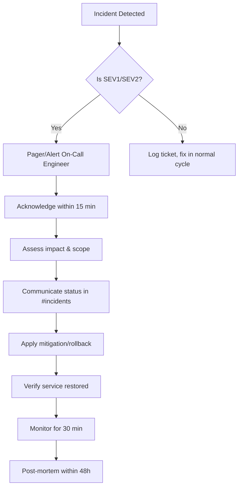

# 🚨 GoMotarCar — Incident Response & Disaster Recovery Plan

> **Version:** 1.0
> **Last Updated:** June 16, 2026
> **Owner:** DevOps / Engineering Team

---

## Table of Contents

1. [Incident Severity Levels](#1-incident-severity-levels)
2. [Incident Response Workflow](#2-incident-response-workflow)
3. [Communication Templates](#3-communication-templates)
4. [Escalation Matrix](#4-escalation-matrix)
5. [Recovery Runbooks](#5-recovery-runbooks)
6. [Post-Mortem Process](#6-post-mortem-process)
7. [Disaster Recovery Plan](#7-disaster-recovery-plan)

---

## 1. Incident Severity Levels

| Level | Label | Definition | Response Time | Examples |
|-------|-------|------------|---------------|----------|
| **SEV1** | 🔴 Critical | Complete service outage, data loss, or security breach | Immediate (≤15 min) | API down, data corruption, payment failures |
| **SEV2** | 🟠 High | Major feature degraded, impacting multiple users | ≤30 min | Login failures, notification delays, slow response times |
| **SEV3** | 🟡 Medium | Minor feature impacted, isolated to few users | ≤2 hours | Upload failures for specific files, minor UI bugs |
| **SEV4** | 🔵 Low | Cosmetic issues, non-functional requests | ≤1 week | Typo in UI, non-critical feature requests |

---

## 2. Incident Response Workflow

### 2.1 Discovery

Incidents may be discovered through:
- **Automated alerts:** UptimeRobot, Sentry error threshold, PM2 health checks
- **User reports:** Customer support tickets, app store reviews
- **Internal monitoring:** Dashboard anomalies, log spikes
- **Manual detection:** Developer/ops noticing issues

### 2.2 Response Steps

#### For ALL Incidents:

1. **Acknowledge** — Confirm the incident in Slack `#incidents` channel
2. **Assess** — Determine severity level (SEV1-SEV4)
3. **Communicate** — Notify stakeholders per severity (see Section 3)
4. **Mitigate** — Apply fix, rollback, or workaround
5. **Resolve** — Verify fix, monitor for stability
6. **Review** — Conduct post-mortem for SEV1/SEV2

### 2.3 SEV1 / SEV2 Response



### 2.4 Key Contacts

| Role | Name | Phone | Email |
|------|------|-------|-------|
| DevOps Lead | [Name] | [Phone] | [Email] |
| Backend Lead | [Name] | [Phone] | [Email] |
| Mobile Lead | [Name] | [Phone] | [Email] |
| Product Manager | [Name] | [Phone] | [Email] |
| Customer Support | [Name] | [Phone] | [Email] |

---

## 3. Communication Templates

### 3.1 Initial Alert (Slack `#incidents`)

```
🚨 INCIDENT: [SEV1/SEV2] - [Brief Title]

Impact: [What's affected and how many users]
Time: [When it started]
Status: [Investigating / Mitigating / Resolved / Monitoring]
Lead: [Engineer name]

Details:
[Brief description of the issue]

Update every: [15/30/60] minutes
```

### 3.2 Status Update

```
🔄 UPDATE: [Title]
Status: [In Progress / Mitigated / Resolved]
Time: [Current time]
Action taken: [What was done]
Next step: [What's next]
ETA: [If applicable]
```

### 3.3 Resolution

```
✅ RESOLVED: [Title]
Time: [Resolution time]
Duration: [Total incident duration]
Root cause: [Brief cause]
Fix applied: [What fixed it]
Post-mortem: [Scheduled date/time]
```

---

## 4. Escalation Matrix

| Escalation Level | Contact | When |
|------------------|---------|------|
| **L1** | On-Call Engineer | Immediately for SEV1/SEV2 |
| **L2** | Engineering Lead | If not resolved in 30 min (SEV1) / 1 hour (SEV2) |
| **L3** | CTO / VP Engineering | If not resolved in 1 hour (SEV1) / 2 hours (SEV2) |
| **L4** | CEO (for external comms) | If public impact or extended downtime |

---

## 5. Recovery Runbooks

### 5.1 API Server Down

```bash
# 1. Check server status
systemctl status nginx
pm2 status
curl http://localhost:5000/health

# 2. Check logs
pm2 logs gomotarcar-api --lines 50
tail -100 /var/log/nginx/error.log

# 3. Restart services
pm2 restart gomotarcar-api
# OR
docker-compose -f docker-compose.prod.yml restart backend

# 4. If still down, check resources
htop
df -h
free -m

# 5. Rollback to previous version (Docker)
docker-compose -f docker-compose.prod.yml pull backend:previous
docker-compose -f docker-compose.prod.yml up -d backend

# 6. Rollback (PM2)
git revert HEAD --no-edit
npm ci --production
pm2 restart gomotarcar-api
```

### 5.2 Database Failure

```bash
# 1. Check MongoDB status
mongosh --eval "db.runCommand({ ping: 1 })"
systemctl status mongod

# 2. Check disk space
df -h /var/lib/mongodb

# 3. Restart MongoDB
systemctl restart mongod

# 4. Restore from latest backup
./scripts/restore.sh --latest --confirm

# 5. Verify data integrity
mongosh --eval "db.getMongo().getDBs()"
```

### 5.3 Redis Failure

```bash
# 1. Check Redis status
redis-cli ping

# 2. Restart Redis
systemctl restart redis-server
# OR
docker-compose -f docker-compose.prod.yml restart redis

# 3. Verify - should return PONG
redis-cli ping
```

### 5.4 SSL Certificate Expiry

```bash
# 1. Check expiry date
certbot certificates

# 2. Force renewal
certbot renew --force-renewal

# 3. Reload nginx
systemctl reload nginx
```

### 5.5 Full Site Recovery (Disaster)

```bash
# 1. Provision new server (or repair existing)
# 2. Install dependencies
sudo apt-get update && sudo apt-get install -y nginx docker docker-compose nodejs npm mongodb-org redis

# 3. Clone repository
git clone https://github.com/your-org/gomotarcar.git /opt/gomotarcar
cd /opt/gomotarcar

# 4. Restore database
./scripts/restore.sh --s3 gomotarcar-backups/daily/latest.archive.gz --confirm

# 5. Start services
docker-compose -f docker-compose.prod.yml up -d

# 6. Verify health
curl http://localhost:5000/health
```

---

## 6. Post-Mortem Process

### 6.1 When to Conduct

- **Required:** SEV1 (within 48 hours), SEV2 (within 1 week)
- **Optional:** SEV3/SEV4 if recurring

### 6.2 Post-Mortem Template

```markdown
# Post-Mortem: [Incident Title]

**Date:** YYYY-MM-DD
**Severity:** SEV1/SEV2
**Duration:** [Start] → [End] (X hours)
**Lead:** [Engineer]
**Participants:** [Names]

## Summary
[1-2 paragraph overview]

## Timeline
- [Time] - Incident detected ([how])
- [Time] - Engineer acknowledged
- [Time] - Initial assessment completed
- [Time] - Mitigation applied
- [Time] - Service verified healthy
- [Time] - Monitoring period ended

## Root Cause Analysis
[Detailed technical explanation]

## Impact
- Users affected: [count/percentage]
- Revenue impact: [if measurable]
- Downtime: [duration]

## Action Items
- [ ] [Action] - Owner - Due date
- [ ] [Action] - Owner - Due date

## Lessons Learned
[What went well, what could be improved]

## Appendices
[Relevant logs, screenshots, graphs]
```

### 6.3 Blame-Free Culture

Post-mortems are **not** for assigning blame. They are for:
- Understanding what happened
- Preventing recurrence
- Improving systems and processes

---

## 7. Disaster Recovery Plan

### 7.1 Recovery Objectives

| Metric | Target |
|--------|--------|
| **RTO** (Recovery Time Objective) | ≤ 1 hour for API, ≤ 4 hours for full platform |
| **RPO** (Recovery Point Objective) | ≤ 24 hours (daily backups) |

### 7.2 Backup Strategy

| Data | Frequency | Retention | Location | Method |
|------|-----------|-----------|----------|--------|
| MongoDB | Daily | 7 daily, 4 weekly, 3 monthly | Local + S3 | mongodump |
| Environment files | Per change | Latest | Secure vault | Manual |
| SSL certificates | Per renewal | Until expiry | Server + backup | certbot |
| Docker images | Per deploy | 10 latest | GHCR | Docker push |

### 7.3 Recovery Scenarios

| Scenario | RTO | Procedure |
|----------|-----|-----------|
| Single API pod crash | < 1 min | PM2/Docker auto-restart |
| Full server failure | < 1 hour | Provision new server, restore from backup |
| Database corruption | < 2 hours | Restore from latest S3 backup |
| Region outage | < 4 hours | Deploy to secondary region |
| Security breach | < 1 hour | Isolate, rotate keys, restore from clean backup |

### 7.4 Disaster Recovery Drill Schedule

- **Monthly:** Backup restoration test
- **Quarterly:** Full failover drill
- **Annually:** DR plan review and update

---

*Document maintained by DevOps team. Review quarterly.*
